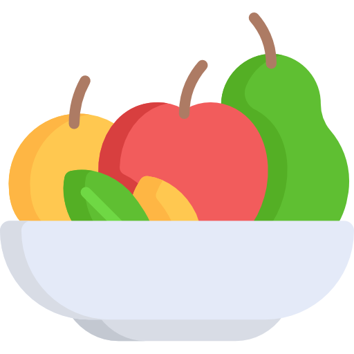

    

<h1 align="center">
  <a href="https://fruitfacts.herokuapp.com/">
    Fruit Facts
  </a>
</h1>

An application built to fetch data from an [API](https://www.fruityvice.com/) to create a fruit gallery.

### Built With

* [React](https://reactjs.org/) - The web framework used
* [Styled Components](https://styled-components.com/) - CSS-in-JS Styling Library for React
* [Fruityvice](https://www.fruityvice.com/) - API Service

### Deployed With
* [Heroku](https://www.heroku.com/) - Cloud Platform
